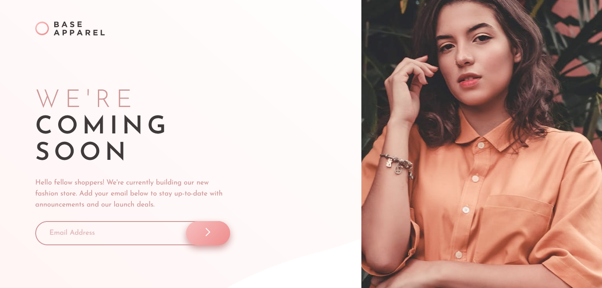

# Frontend Mentor - Base Apparel coming soon page solution

This is a solution to the [Base Apparel coming soon page challenge on Frontend Mentor](https://www.frontendmentor.io/challenges/base-apparel-coming-soon-page-5d46b47f8db8a7063f9331a0). Frontend Mentor challenges help you improve your coding skills by building realistic projects.

## Table of contents

- [Overview](#overview)
  - [The challenge](#the-challenge)
  - [Screenshot](#screenshot)
  - [Links](#links)
  - [Built with](#built-with)
  - [What I learned](#what-i-learned)
- [Author](#author)

## Overview

I found this challenge on frontendmentor.io and tried this to boost my css skills.

### The challenge

Users should be able to:

- View the optimal layout for the site depending on their device's screen size
- See hover states for all interactive elements on the page
- Receive an error message when the `form` is submitted if:
  - The `input` field is empty
  - The email address is not formatted correctly

### Screenshot

### Links

- Solution URL: [Github](https://github.com/pranto-bapary/base-apparel-coming-soon)
- Live Site URL: [Github Pages](https://pranto-bapary.github.io/base-apparel-coming-soon)

### Built with

- Semantic HTML5 markup
- SASS
- CSS custom properties
- CSS Grid
- Flexbox
- Mobile-first workflow
- [Google Font](https://fonts.google.com) - For Fonts.

### What I learned

By doing this challenge I've successfully learned about CSS Grid,Flexbox and Responsive Design

## Author

- Website - [Pranto](https://facebook.com/ashfe.pranto)
